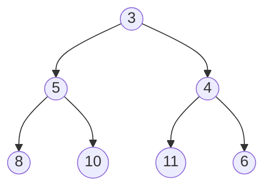
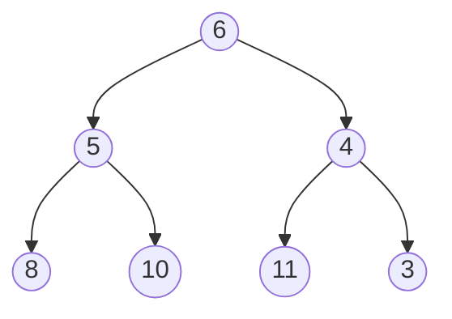
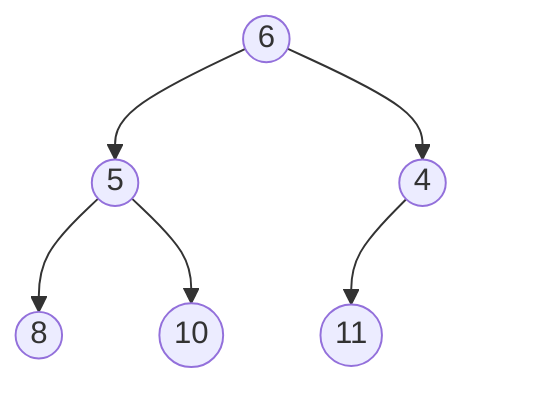
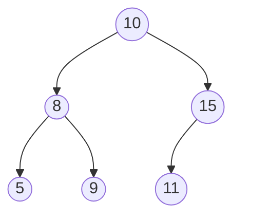

# 堆

堆用来解决一些需要快速排序，并且每次只关心排序后最值的问题．

C++ STL 中的优先队列就是用堆实现的．

堆是特殊的二叉树，有一个最重要的性质：对于堆中的任何一个节点，都保证其子节点的值严格大于父节点．

例如下面一张图就符合堆的性质


## 堆的操作

### 节点添加

设需要在上图中添加一个元素 4，我们可以这么做：

首先，我们先将要添加的节点放到最下一层最右边的叶子之后．如果最下一层已满，就新增一层．


而后，尝试让新的节点和其父节点交换位置．在这个例子中，显然，4 是比 6 要小的，为了保证堆的性质，我们要让 4 和 6 换个位置．



显然，3 是比 4 要小的，已经满足了堆的性质，这一次添加操作就此结束．

### 堆的删除

堆支持删除最顶上的一个节点．


为了对上面一张图的顶点（即值为 3 的点）进行删除，我们可以这样做：

首先，把这个点和最后一个点交换位置



再把最后一个点删掉



然后，由于这个图不满足堆的定义，所以我们从他的子节点中选择一个最小的，和根节点交换，作为新的根节点．


之后一直交换，直到其所有子节点都大于父节点，或没有子节点为止．

### 查询最小值

这个最简单，此时堆顶的元素最小，没有比它更小的了．

## 复杂度分析

节点添加操作平均是 $O(\log n)$ 的，但最坏 $O(n)$．

查询最小值 $O(1)$．

删除操作平均是 $O(\log n)$ 的，但最坏 $O(n)$．

>[!note]- 题目：P3378 【模板】堆
>
> ### 题目描述
>
> 给定一个数列，初始为空，请支持下面三种操作：
>
> 1. 给定一个整数 $x$，请将 $x$ 加入到数列中．
> 2. 输出数列中最小的数．
> 3. 删除数列中最小的数（如果有多个数最小，只删除 $1$ 个）．
> 
> ### 输入格式
>
> 第一行是一个整数，表示操作的次数 $n$．
> 接下来 $n$ 行，每行表示一次操作．每行首先有一个整数 $op$ 表示操作类型．
>
> - 若 $op = 1$，则后面有一个整数 $x$，表示要将 $x$ 加入数列．
> - 若 $op = 2$，则表示要求输出数列中的最小数．
> - 若 $op = 3$，则表示删除数列中的最小数．如果有多个数最小，只删除 $1$ 个．
> 
> ### 输出格式
>
> 对于每个操作 $2$，输出一行一个整数表示答案．
>
> ### 数据范围
> 
> 对于 $100\%$ 的数据，保证 $1 \leq n \leq 10^6$，$1 \leq x \lt 2^{31}$，$op \in \{1, 2, 3\}$．

## 标程

```cpp
#include <bits/stdc++.h>
using namespace std;
#define fa(x) (x / 2)
#define lson(x) (2 * x)
#define rson(x) (2 * x + 1)

const int N = 1e6 + 100;
const int root = 1;

int n;

class Heap
{
private:
    int size = 0;
    int a[N];

public:
    Heap()
    {
        memset(a, 0x3f, sizeof(a));
    }
    void push(int x)
    {
        a[++size] = x;
        int now = size;
        while (now > root)
        {
            if (a[now] < a[fa(now)])
            {
                swap(a[now], a[fa(now)]);
                now = fa(now);
            }
            else
                break;
        }
    }
    int query()
    {
        return a[root];
    }
    void remove()
    {
        int now = root;
        a[root] = a[size];
        size--;
        while (lson(now) <= size)
        {
            int minn = lson(now);
            if (rson(now) <= size && a[rson(now)] < a[minn])
                minn = rson(now);
            if (a[now] > a[minn])
            {
                swap(a[now], a[minn]);
                now = minn;
            }
            else
                break;
        }
    }
};

signed main()
{
    cin >> n;
    Heap heap;
    for (int i = 1; i <= n; i++)
    {
        int op;
        cin >> op;
        if (op == 1)
        {
            int x;
            cin >> x;
            heap.push(x);
        }
        if (op == 2)
            cout << heap.query() << endl;
        if (op == 3)
            heap.remove();
    }
    return 0;
}
```

# 二叉搜索树

>[!note]- 题目：P3369【模板】普通平衡树
>
> ### 题目描述
>
> 您需要动态地维护一个可重集合 $M$，并且提供以下操作：
>
> 1. 向 $M$ 中插入一个数 $x$．
> 2. 从 $M$ 中删除一个数 $x$（若有多个相同的数，应只删除一个）．
> 3. 查询 $M$ 中有多少个数比 $x$ 小，并且将得到的答案加一．
> 4. 查询如果将 $M$ 从小到大排列后，排名位于第 $x$ 位的数．
> 5. 查询 $M$ 中 $x$ 的前驱（前驱定义为小于 $x$，且最大的数）．
> 6. 查询 $M$ 中 $x$ 的后继（后继定义为大于 $x$，且最小的数）．
> 
> 对于操作 $3,5,6$，**不保证**当前可重集中存在数 $x$．
>
> 对于操作 $5,6$，保证答案一定存在．
>
> ### 输入格式
>
> 第一行为 $n$，表示操作的个数，下面 $n$ 行每行有两个数 $\text{opt}$ 和 $x$，$\text{opt}$ 表示操作的序号（$1 \leq \text{opt} \leq 6$）．
>
> ### 输出格式
>
> 对于操作 $3,4,5,6$ 每行输出一个数，表示对应答案．
>
> ### 数据范围
> 
> 对于 $100\%$ 的数据，$1\le n \le 10^5$，$|x| \le 10^7$．

二叉搜索树是一种特殊的树，其特点为：对于一个节点，其左子树上的节点总是小于父节点，而其右子树上的节点总是大于父节点．

例如下面一张图就符合二叉搜索树的性质



对于每一个节点，我们需要记录一些信息：

- `v`：该节点的值．
- `num`：为了让二叉搜索树能够存储重复的数据，我们将数值相同的节点合并．`num` 表示树中共有 `num` 个数值为 `v` 的值，即该节点是由 `num` 个节点合并而来的．
- `lson`：该节点的左子节点．
- `rson`：该节点的右子节点．
- `size`：以本节点为根的子树中一共有多少个数（此处不是节点，是因为每一个节点可能储存多个相同的数），包括根节点．

```cpp
struct Node {
	int v;
	int num;
	int size;
	int lson;
	int rson;

	Node() : v(0), num(0), size(0), lson(0), rson(0) {}

	Node(int v, int num = 1) {
		init(v, num);
	}

	void init(int v, int num) {
		this->v = v;
		this->num = num;
		this->size = num;
	}

	// 左节点
	int lsize();
	// 右节点
	int rsize();
	// 计算大小
	void push_up() {
		size = lsize() + rsize() + num;
	}
} node[N];

int Node::lsize() {
	return node[lson].size;
}
int Node::rsize() {
	return node[rson].size;
}
```

定义一个类用来存放操作函数：

```cpp
class Tree {
public:
	// 当前根节点
	int ROOT = 0;
	// 当前树中节点数量
	int tot = 0;
	queue<int> free_node;
};
```

## 插入

插入很简单，只需要从根节点向下遍历一遍，找到最适合的位置．

对于一个节点 $k$，要在以该节点为根的子树中插入一个元素 $x$，有两种情况

- 若节点 $k$ 是空的，则将 $x$ 放在 $k$ 的位置．
- 若节点 $k$ 非空，则
    - $x = k$，将节点 $k$ 的 `num` 值增加即可．
    - $x\lt k$，可以转化为在节点为 $k_{lson}$ 为根的子树下插入元素 $x$．
    - $x \gt k$，可以转化为在节点为 $k_{rson}$ 为根的子树下插入元素 $x$．

最后，在统计 `size` 时，可以使用类似于线段树的 `pushup` 方法，将左右子树的 `size` 相加即可．

时间复杂度为 $O(h)$，$h$ 为高度，最坏 $O(n)$

由于有删除有新增，所以需要一个函数来动态管理内存．

```cpp
class Tree {
public:
	// 当前空的节点
	// 会在删除时，将删除后空出来的位置记录
	queue<int> free_node;
	// 获得下一个空位
	int next_node_pos() {
		if (!free_node.empty()) {
			// 有空位
			int u = free_node.front();
			free_node.pop();
			return u;
		}
		// 开辟新的位子
		return ++tot;
	}
};
```

以下代码使用递归进行插入：

```cpp
void insert(int x, int& now) { // now是int&，&不能忘记
	if (now == 0)
	{
		// 当前节点是空的
		// 申请新的空间
		now = next_node_pos();
		// 登记挂载到父节点上
		node[now] = Node(x);
	}
	else {
		if (node[now].v == x) {
			node[now].num++;
		}
		else if (node[now].v < x) {
			insert(x, node[now].rson);
		}
		else {
			insert(x, node[now].lson);
		}
	}
	node[now].push_up();
}
```

## 查询排名

依旧的，进行一次搜索．

如果你想要查询 $x$ 在树中是排第几位的，那么只需要算出比 $x$ 小的数有几个，而后，将结果加一，即为排名．

特殊的，如果 $x$ 不存在，则假想 $x$ 存在，即定义 $x$ 的排名为比 $x$ 小的数的个数加一．

为了统计比 $x$ 小的数有几个，如果你当前遍历到节点 $k$，那么有以下三种情况：

- $x \lt k$，比 $x$ 小的数一定都在 $k$ 的左子树上，可以舍弃右子树，继续遍历左子树．
- $x=k$，其实和 $x \lt k$ 的情况是一样的．
- $x \gt k$，此时左子树中的一定都是比 $x$ 小的，右子树中有部分．将左子树和 $k$ 计入答案，继续遍历右子树．

```cpp
int rank(int x) {
	int now = ROOT;
	int ans = 0;
	while (now) {
		if (x <= node[now].v) {
			now = node[now].lson;
		}
		else if (x > node[now].v) {
			ans += node[now].lsize() + node[now].num;
			now = node[now].rson;
		}
	}
	return ans + 1;
}
```

## 查询第几大

为了查询第 $x$ 大的数，如果你当前遍历到节点 $k$，若定义 $k$ 的左子树大小为 $k_{lsize}$，那么有以下三种情况：

- $x \le k_{lsize}$，即第 $x$ 大的数在 $k$ 的左子树，只需要继续遍历左子树即可．
- $k_{lsize} \gt x \le k_{lsize} + k_{num}$，即第 $x$ 大的数就是 $k$
- 否则，第 $x$ 大的数在 $k$ 的右子树，将 $x$ 减去左子树和 $k$ 点的数量后，继续遍历右子树．

```cpp
int kth(int x) {
	int now = ROOT;
	while (now) {
		if (node[now].lsize() >= x) {
			now = node[now].lson;
		}
		else if (node[now].lsize() + node[now].num >= x) {
			return node[now].v;
		}
		else {
			x -= node[now].lsize() + node[now].num;
			now = node[now].rson;
		}
	}
	return -1; // 不会抵达
}
```

## 查询前驱/后继

计算前驱（即最大的比 $x$ 小的数），可以得知 $x$ 的排名后，再将排名减一后用 `kth` 查询即可．

计算后继（即最小的比 $x$ 大的数），显然，后继一定比原数至少大 1，可以通过得知 $x+1$ 的排名后，通过这个排名来用 `kth` 查询．

```cpp
int pre(int x) {
	return kth(rank(x) - 1);
}
int succ(int x) {
	return kth(rank(x + 1));
}
```

## 删除

为了删除 $x$，如果你当前遍历到节点 $k$，那么有以下三种情况：

- $x \lt k$，$x$ 一定在 $k$ 的左子树上，可以继续遍历左子树．
- $x \gt k$，$x$ 一定在 $k$ 的右子树上，可以继续遍历右子树．
- $x=k$
    - 如果 $k_{num} \ne 1$，即还有多个此种数字，那么直接让 $k_{num}-1$ 即可．
    - 否则，就需要删除这个节点
        - 如果节点 $k$ 没有子节点，直接删
        - 如果节点 $k$ 只有左子节点或右子节点，那么将其子节点覆盖父节点．
        - 如果 $k$ 有两个子节点，那么，寻找 $k$ 的前驱或后继，将其**覆盖**节点 $k$（注意，一定是**覆盖**而非**替换**，因为如果替换就会破坏平衡树的大小规则）．可以证明，节点 $k$ 的前驱和后继分别在 $k$ 的左子树和右子树上．并且，$k$ 的前驱和后继必然大于原来 $k$ 的左子树上的节点且小于原来 $k$ 右子树上的节点．

```cpp
void remove(int x, int& now) {
	if (!now) return;
	if (x < node[now].v) {
		remove(x, node[now].lson);
	}
	else if (x > node[now].v) {
		remove(x, node[now].rson);
	}
	else {
		// 找到要删除的节点
		if (node[now].num > 1) {
			// 节点有大于1个元素，直接删
			node[now].num--;
		}
		else if (node[now].lson == 0 && node[now].rson == 0) {
			// 节点左右都没有节点，直接删
			// 由于删除之后这个位置会空缺，所以记录
			free_node.push(now);
			// 在父节点登记
			now = 0;
		}
		else if (node[now].lson == 0) {
			// 节点没有左节点
			// 由于删除之后这个位置会空缺，所以记录
			free_node.push(now);
			// 在父节点登记
			now = node[now].rson;
		}
		else if (node[now].rson == 0) {
			// 节点没有右节点，和左节点相同
			free_node.push(now);
			now = node[now].lson;
		}
		else {
			// 节点又有左节点，又有右节点
			// 获取后继的值
			int suc = node[now].rson;
			// 获取值对应的下标
			while (node[suc].lson) suc = node[suc].lson;
			// 覆盖
			node[now].v = node[suc].v;
			node[now].num = node[suc].num;
			// 防止删不掉
			node[suc].num = 1;
			// 在右节点范围进行删除
			remove(node[suc].v, node[now].rson);
		}
	}
	// 由于对节点进行了改动，需要重新计算大小
	// 一定要避免对节点0的push_up
	if (now) node[now].push_up();
}
```

## 时间复杂度

每一项操作的时间复杂度都是 $O(h)$，其中 $h$ 是深度，共有 $n$ 次操作，综合最坏 $O(n^2)$．

## 标程

```cpp
#include <bits/stdc++.h>
using namespace std;

const int N = 1e5 + 100;
int n;

struct Node {
	int v;
	int num;
	int size;
	int lson;
	int rson;

	Node() : v(0), num(0), size(0), lson(0), rson(0) {}

	Node(int v, int num = 1) {
		init(v, num);
	}

	void init(int v, int num) {
		this->v = v;
		this->num = num;
		this->size = num;
	}

	int lsize();
	int rsize();
	void push_up() {
		size = lsize() + rsize() + num;
	}
} node[N];

int Node::lsize() {
	return node[lson].size;
}
int Node::rsize() {
	return node[rson].size;
}

class Tree {
public:
	int ROOT = 0;
	int tot = 0;
	queue<int> free_node;

	int next_node_pos() {
		if (!free_node.empty()) {
			int u = free_node.front();
			free_node.pop();
			return u;
		}
		return ++tot;
	}

	void insert(int x, int& now) {
		if (now == 0)
		{
			now = next_node_pos();
			node[now] = Node(x);
		}
		else {
			if (node[now].v == x) {
				node[now].num++;
			}
			else if (node[now].v < x) {
				insert(x, node[now].rson);
			}
			else {
				insert(x, node[now].lson);
			}
		}
		node[now].push_up();
	}

	int rank(int x) {
		int now = ROOT;
		int ans = 0;
		while (now) {
			if (x <= node[now].v) {
				now = node[now].lson;
			}
			else if (x > node[now].v) {
				ans += node[now].lsize() + node[now].num;
				now = node[now].rson;
			}
		}
		return ans + 1;
	}

	int kth(int x) {
		int now = ROOT;
		while (now) {
			if (node[now].lsize() >= x) {
				now = node[now].lson;
			}
			else if (node[now].lsize() + node[now].num >= x) {
				return node[now].v;
			}
			else {
				x -= node[now].lsize() + node[now].num;
				now = node[now].rson;
			}
		}
		return -1;
	}

	int pre(int x) {
		return kth(rank(x) - 1);
	}
	int succ(int x) {
		return kth(rank(x + 1));
	}

	void remove(int x, int& now) {
		if (!now) return;
		if (x < node[now].v) {
			remove(x, node[now].lson);
		}
		else if (x > node[now].v) {
			remove(x, node[now].rson);
		}
		else {
			if (node[now].num > 1) {
				node[now].num--;
			}
			else if (node[now].lson == 0 && node[now].rson == 0) {
				free_node.push(now);
				now = 0;
			}
			else if (node[now].lson == 0) {
				free_node.push(now);
				now = node[now].rson;
			}
			else if (node[now].rson == 0) {
				free_node.push(now);
				now = node[now].lson;
			}
			else {
				int suc = node[now].rson;
				while (node[suc].lson) suc = node[suc].lson;
				node[now].v = node[suc].v;
				node[now].num = node[suc].num;
				node[suc].num = 1;
				remove(node[suc].v, node[now].rson);
			}
		}
		if (now) node[now].push_up();
	}
};

int main() {
	cin >> n;
	Tree tree;
	for (int i = 1; i <= n; i++) {
		int opt, x;
		cin >> opt >> x;
		if (opt == 1) {
			tree.insert(x, tree.ROOT);
		}
		if (opt == 2) {
			tree.remove(x, tree.ROOT);
		}
		if (opt == 3) {
			cout << tree.rank(x) << endl;
		}
		if (opt == 4) {
			cout << tree.kth(x) << endl;
		}
		if (opt == 5) {
			cout << tree.pre(x) << endl;
		}
		if (opt == 6) {
			cout << tree.succ(x) << endl;
		}
	}
	return 0;
}
```

# 二叉平衡树

显然最坏 $O(n^2)$ 的时间复杂度无法通过，所以需要一些优化．

## 替罪羊树

很显然，之所以会有最坏 $O(n^2)$，是因为失衡，使其退化成了接近链的形式．

因此，只需要在插入之后进行一次重构，就可以解决这个问题．

究竟在何时重构呢？在这里要引入一个常数 $\alpha \in (0.5, 1)$（常取 0.75），当左子树节点数 $siz_1$ 和右子树节点数 $siz_2$ 和当前字数总节点数 $siz_0$ 满足 $max(siz_1, siz_2) > \alpha siz_0$ 时，需要重构．

为了实现，我们需要定义：

```cpp
struct Node {
	int v;
	int num;
	int size;
	// 用于计算当前字数中有多少个节点
	int tot; // [!code highlight]
	int lson;
	int rson;

	Node() : v(0), num(0), size(0), lson(0), rson(0), tot(0) {}

	Node(int v, int num = 1) {
		init(v, num);
	}

	void init(int v, int num) {
		this->v = v;
		this->num = num;
		this->size = num;
		this->tot = 1;
	}

	int lsize();
	int rsize();
	int ltot();
	int rtot();
	void push_up() {
		size = lsize() + rsize() + num;
		// 注意比对size和tot之间更新的差异
		tot = ltot() + rtot() + 1; // [!code highlight]
	}
} node[N];

int Node::lsize() {
	return node[lson].size;
}
int Node::rsize() {
	return node[rson].size;
}
int Node::ltot() {
	return node[lson].tot;
}
int Node::rtot() {
	return node[rson].tot;
}
```

在插入时，我们需要在回溯时判断这个节点是否平衡，如果不平衡，将其记录．

每一次插入，只有一个节点，即最上面的一个不平衡的节点需要被视为重构的根节点．

```cpp
int insert(int x, int& now) {
	// 记录重构的节点
	// 此处的null是一个常数，代表没有节点需要重构
	// 可以将其定义为-1或INT_MIN
	int ref_node = null; // [!code highlight]
	if (now == 0)
	{
		now = next_node_pos();
		node[now] = Node(x);
	}
	else {
		if (node[now].v == x) {
			node[now].num++;
		}
		else if (node[now].v < x) {
			ref_node = insert(x, node[now].rson);
		}
		else {
			ref_node = insert(x, node[now].lson);
		}
	}
	node[now].push_up();
	// 如果该节点不平衡，就记录该节点．
	// [!code highlight:3]
	if (max(node[now].ltot(), node[now].rtot()) > node[now].tot * ALPHA) 
		ref_node = now;
	return ref_node;
}
```

在 `main` 函数中处理 `insert` 的返回值．

```cpp
if (opt == 1) {
	int ref_node = tree.insert(x, tree.ROOT);
	if (ref_node != null) {
		tree.rebuild(ref_node);
	}
}
```

当需要重构时，调用重构函数．重构主要需要完成以下几件事：

- 获取中序遍历结果．
- 删除子树中的所有节点．
- 用像线段树一样的方法去重建树．

```cpp
public:
	void rebuild(int root) {
		// 获取中序遍历结果，并删除节点
		// 这里pair的第一个参数表示值（v），第二个参数表示数量（num）
		vector<pair<int, int> > list;
		flatten(node[root].lson, list);
		list.push_back({ node[root].v, node[root].num });
		flatten(node[root].rson, list);
		// 重建树
		build(root, list, 0, list.size() - 1);
	}

private:
	// 展平操作
	// 将以root为根的子树中序遍历并完全删除，结果储存到list中
	// 这里list是引用类型，&不要忘了加
	void flatten(int root, vector<pair<int, int> >& list) {
		// 防止根节点是空的
		if (root == 0) return;
		// 展平左节点
		flatten(node[root].lson, list);
		// 加入自身
		list.push_back({ node[root].v, node[root].num });
		// 展平右节点
		flatten(node[root].rson, list);
		// 删除自身
		free_node.push(root);
	}
	// 使用list中[l,r]的部分以root为根节点重建
	// 此处的list一定要是引用类型，因为如果是值传递，频繁的拷贝vector会导致复杂度急剧上升
	void build(int root, const vector<pair<int, int> >& list, int l, int r) {
		// 获取root应为的值和数量，即list[mid]
		int mid = (l + r) / 2;
		node[root] = Node(list[mid].first, list[mid].second);
	
		if (l <= mid - 1)
		{
			// 构建左子树
			node[root].lson = next_node_pos();
			build(node[root].lson, list, l, mid - 1);
		}
		if (mid + 1 <= r)
		{
			// 构建右子树
			node[root].rson = next_node_pos();
			build(node[root].rson, list, mid + 1, r);
		}
	
		// 由于构建操作更改了节点，所以需要push_up
		node[root].push_up();
	}
```

### 时间复杂度

由于使用了重构，所以单次操作时间复杂度是均摊 $O(\log n)$ 的，总时间复杂度 $O(n\log n)$

### 标程

```cpp
#include <bits/stdc++.h>
using namespace std;

const int N = 1e5 + 100;
const double ALPHA = 0.75;
const int null = INT_MIN;
int n;

struct Node {
	int v;
	int num;
	int size;
	int tot;
	int lson;
	int rson;

	Node() : v(0), num(0), size(0), lson(0), rson(0), tot(0) {}

	Node(int v, int num = 1) {
		init(v, num);
	}

	void init(int v, int num) {
		this->v = v;
		this->num = num;
		this->size = num;
		this->tot = 1;
	}

	int lsize();
	int rsize();
	int ltot();
	int rtot();
	void push_up() {
		size = lsize() + rsize() + num;
		tot = ltot() + rtot() + 1;
	}
} node[N];

int Node::lsize() {
	return node[lson].size;
}
int Node::rsize() {
	return node[rson].size;
}
int Node::ltot() {
	return node[lson].tot;
}
int Node::rtot() {
	return node[rson].tot;
}

class Tree {
public:
	int ROOT = 0;
	int tot = 0;
	queue<int> free_node;

	int next_node_pos() {
		if (!free_node.empty()) {
			int u = free_node.front();
			free_node.pop();
			return u;
		}
		return ++tot;
	}

	int insert(int x, int& now) {
		int ref_node = null;
		if (now == 0)
		{
			now = next_node_pos();
			node[now] = Node(x);
		}
		else {
			if (node[now].v == x) {
				node[now].num++;
			}
			else if (node[now].v < x) {
				ref_node = insert(x, node[now].rson);
			}
			else {
				ref_node = insert(x, node[now].lson);
			}
		}
		node[now].push_up();
		if (max(node[now].ltot(), node[now].rtot()) > node[now].tot * ALPHA) {
			ref_node = now;
		}
		return ref_node;
	}

	int rank(int x) {
		int now = ROOT;
		int ans = 0;
		while (now) {
			if (x <= node[now].v) {
				now = node[now].lson;
			}
			else if (x > node[now].v) {
				ans += node[now].lsize() + node[now].num;
				now = node[now].rson;
			}
		}
		return ans + 1;
	}

	int kth(int x) {
		int now = ROOT;
		while (now) {
			if (node[now].lsize() >= x) {
				now = node[now].lson;
			}
			else if (node[now].lsize() + node[now].num >= x) {
				return node[now].v;
			}
			else {
				x -= node[now].lsize() + node[now].num;
				now = node[now].rson;
			}
		}
		return -1;
	}

	int pre(int x) {
		return kth(rank(x) - 1);
	}
	int succ(int x) {
		return kth(rank(x + 1));
	}

	void remove(int x, int& now) {
		if (!now) return;
		if (x < node[now].v) {
			remove(x, node[now].lson);
		}
		else if (x > node[now].v) {
			remove(x, node[now].rson);
		}
		else {
			if (node[now].num > 1) {
				node[now].num--;
			}
			else if (node[now].lson == 0 && node[now].rson == 0) {
				free_node.push(now);
				now = 0;
			}
			else if (node[now].lson == 0) {
				free_node.push(now);
				now = node[now].rson;
			}
			else if (node[now].rson == 0) {
				free_node.push(now);
				now = node[now].lson;
			}
			else {
				int suc = node[now].rson;
				while (node[suc].lson) suc = node[suc].lson;
				node[now].v = node[suc].v;
				node[now].num = node[suc].num;
				node[suc].num = 1;
				remove(node[suc].v, node[now].rson);
			}
		}
		if (now) node[now].push_up();
	}

	void rebuild(int root) {
		vector<pair<int, int> > list;
		flatten(node[root].lson, list);
		list.push_back({ node[root].v, node[root].num });
		flatten(node[root].rson, list);
		build(root, list, 0, list.size() - 1);
	}
private:
	void flatten(int root, vector<pair<int, int> >& list) {
		if (root == 0) return;
		flatten(node[root].lson, list);
		list.push_back({ node[root].v, node[root].num });
		flatten(node[root].rson, list);
		free_node.push(root);
	}
	void build(int root, const vector<pair<int, int> >& list, int l, int r) {
		int mid = (l + r) / 2;
		node[root] = Node(list[mid].first, list[mid].second);

		if (l <= mid - 1)
		{
			node[root].lson = next_node_pos();
			build(node[root].lson, list, l, mid - 1);
		}
		if (mid + 1 <= r)
		{
			node[root].rson = next_node_pos();
			build(node[root].rson, list, mid + 1, r);
		}

		node[root].push_up();
	}
};

int main() {
	ios::sync_with_stdio(false);
	cin.tie(nullptr);
	cin >> n;
	Tree tree;
	for (int i = 1; i <= n; i++) {
		int opt, x;
		cin >> opt >> x;
		if (opt == 1) {
			int ref_node = tree.insert(x, tree.ROOT);
			if (ref_node != null) {
				tree.rebuild(ref_node);
			}
		}
		if (opt == 2) {
			tree.remove(x, tree.ROOT);
		}
		if (opt == 3) {
			cout << tree.rank(x) << endl;
		}
		if (opt == 4) {
			cout << tree.kth(x) << endl;
		}
		if (opt == 5) {
			cout << tree.pre(x) << endl;
		}
		if (opt == 6) {
			cout << tree.succ(x) << endl;
		}
	}
	return 0;
}
```
