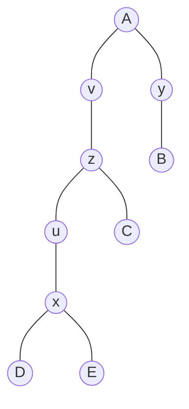

> [!NOTE]- 原题呈现
> # P6374 树上询问
>
> ## 题目描述
>
> 给定一棵 $n$ 个点的无根树，有 $q$ 次询问．
>
> 每次询问给一个参数三元组 $(a,b,c)$，求有多少个 $i$ 满足这棵树在以 $i$ 为根的情况下 $a$ 和 $b$ 的最近公共祖先为 $c$．
>
> ## 输入格式
>
> 第一行 $2$ 个数，为 $n$ 和 $q$．
>
> 接下来 $n-1$ 行，每行 $2$ 个数，表示树的一条边．
>
> 接下来 $q$ 行，每行 $3$ 个数，为 $(a,b,c)$．
>
> ## 输出格式
>
> 共 $q$ 行，每行一个数，为对于每个三元组的 $i$ 的个数．
>
> ## 输入输出样例 #1
>
> ### 输入 #1
>
> ```
> 10 5
> 1 2
> 1 3
> 2 4
> 2 5
> 2 10
> 5 6
> 3 7
> 7 8
> 7 9
> 4 6 2
> 4 10 1
> 6 8 3
> 9 10 2
> 4 10 5
> 
> ```
>
> ### 输出 #1
>
> ```
> 7
> 0
> 1
> 4
> 0
> 
> ```
>
> ## 输入输出样例 #2
>
> ### 输入 #2
>
> ```
> 5 3
> 1 3
> 1 5
> 3 4
> 3 2
> 5 2 3
> 5 2 1
> 2 4 5
> 
> ```
>
> ### 输出 #2
>
> ```
> 2
> 1
> 0
> ```
>
> ## 输入输出样例 #3
>
> ### 输入 #3
>
> ```
> 20 10
> 1 2
> 1 3
> 1 4
> 2 5
> 2 6
> 3 10
> 4 13
> 4 14
> 6 7
> 6 8
> 10 11
> 4 15
> 4 16
> 8 9
> 11 12
> 16 17
> 16 18
> 16 19
> 17 20
> 15 19 16
> 1 12 1
> 20 20 20
> 7 7 8
> 1 8 3
> 5 20 2
> 2 9 6
> 9 12 1
> 9 12 2
> 9 12 3
> ```
>
> ### 输出 #3
>
> ```
> 4
> 16
> 20
> 0
> 0
> 5
> 2
> 10
> 2
> 1
> 
> ```
>
> ## 说明/提示
>
> ---
>
> #### 样例 2 解释
>
> 
>
> 第一个查询的 $i$ 为 $3$ 和 $4$．
>
> 第二个查询的 $i$ 为 $1$．
>
> ---
>
> #### 数据范围
>
> #### 本题按子任务测试：
>
> - Subtask 1（$20$ pts）：$1 \leq n \leq 1000$，$1 \leq q \leq 500$．
> 
> - Subtask 2（$15$ pts）：$1 \leq n \leq 10^{5}$，$1 \leq q \leq 10^{5}$，树退化成链．
> 
> - Subtask 3（$25$ pts）：$1 \leq n \leq 5 \times 10^{5}$，$1 \leq q \leq 10^{5}$，数据**不随机**．
> 
> - Subtask 4（$40$ pts）：$1 \leq n \leq 5 \times$ $10^{5}$，$1 \leq q \leq 2 \times 10^{5}$．
> 
> 对于所有数据：$1 \leq n \leq 5 \times 10^{5}$，$1 \leq q \leq 2 \times 10^{5}$．
>
> 注：数据强度不高，不必卡常与快读快输．

考虑样例 2，当询问为 $(2, 5, z)$ 时，此时，

| 根节点 | lca(2,5) |
| --- | -------- |
| 1   | 1        |
| 2   | 2        |
| 3   | 3        |
| 4   | 3        |
| 5   | 5        |

显然，不在 $2\to 5$ 这条链上的 $4$ 不可能为两节点的最近公共祖先．实际上，对于询问 $(x,y,z)$，不在 $x\to y$ 这条链上的所有点 $a$，若满足 $a=z$，则方案数必然为 $0$．因为若 $a$ 与 $x\to y$ 连通时存在一个汇入点 $b$，满足 $a\to b$ 和 $x\to y$ 交于点 $b$，且点 $b$ 在 $x\to y$ 上，则此时路径 $a\to x$ 和 $a\to y$ 会有重合（$a\to b$）．因此，$a$ 不能成为 $x,y$ 的最近公共祖先．

那对于 $z$ 在 $x\to y$ 上的情况怎么办呢？那么此时首先，$z$ 自身可以作为根节点．其次，不在 $x\to y$ 上的点，且与 $z$ 连通的点可以将 $z$ 拎起来．因此，答案就是不在 $x\to y$ 上且与 $z$ 直接相连（这里指不通过 $x\to y$ 上的任何边就能够相连）的点以及 $z$ 本身的节点数量．

考虑如何 $O(1)$ 算出．显然，我们可以以 $1$ 为根建树进行一次 dfs，那么，对于询问 $(x,y,z)$，会有四种可能：

- $z$ 不在 $x\to y$ 上．此时根据分析，输出 0．
- $z$ 正好是 $x,y$ 的最近公共祖先．此时，所有可能的根节点就是 $z$ 去除含有 $x,y$ 的两颗子树（这里含有……的子树指所有以 $z$ 子节点为根节点的子树中含有该节点的子树，下同）大小，剩余的图中所有点都可以作根
- $z$ 在 $x,y$ 的最近公共祖先的含有 $x$ 的子树上，如上述样例中的 $(2,5,3)$，$3$ 就在 $2,5$ 最近公共祖先 $1$ 的含有 $2$ 的子树上．再如下图中的 $(x,y,z)$，那么此时，$z$ 的子树中含有 $x$ 的子树部分（即图中节点 $u,x,D,E$）肯定不行（因为子树上的任意一点都需要经过 $u\to z$，这条边在 $x\to y$ 上），且此时除了 $z$ 子树之外的部分 $s$ （即图中点 $A,b,y,v$）也不能作为子节点（因为 $s$ 上的每一个点想要到达 $z$ 都需要经过 $v\to z$，显然 $y$ 不在 $z$ 的子树上，故 $y\to z\to x$ 也需要通过 $v\to z$，因此 $v\to z$ 在 $x\to y$ 上）因此答案为：所有的节点，减去 $z$ 子树中含有 $x$ 的子树大小，再减去不在 $z$ 子树中的节点．
- $z$ 在 $x,y$ 的最近公共祖先的有 $y$ 的子树上，这一种和上一种相同．



> [!NOTE] 小技巧：如何 $O(1)$ 计算一个点是否是另外一个点的子孙节点．
> 这需要用到 dfs 序，所谓 dfs 序，就是通过 dfs 首次先序遍历到每一个节点的次序，这可以在 dfs 的时候预处理出来．节点 $u$ 的 dfs 序常记为 $\operatorname{dfn}_u$．
> 不难发现，同一个子树内的节点，$dfn$ 是连续的．可以利用这个性质，若我们现在想要知道 $v$ 是否是 $u$ 的子节点，那么这个命题完全等同于：
>
> $$
> \DeclareMathOperator{\dfn}{dfn}
> \dfn_u \leq \dfn_v \lt \dfn_u + size
> $$
>
> ，其中，$size$ 为 $u$ 及其子节点的数量．

可以写出代码：

```cpp
#include <bits/stdc++.h>
using namespace std;
const int N = 5e5 + 100;
int n, q;
vector<int> e[N];
int f[22][N], cnt, dfn[N], sz[N], dep[N];

int LCA(int x, int y) {
    if (dep[x] > dep[y]) {
        swap(x, y);
    }
    int step = dep[y] - dep[x];
    for (int i = 20; i >= 0; i--) {
        if (step & (1 << i)) {
            y = f[i][y];
        }
    }
    if (x == y)
        return x;
    for (int i = 20; i >= 0; i--) {
        if (f[i][x] != f[i][y]) {
            x = f[i][x];
            y = f[i][y];
        }
    }
    return f[0][x];
}

void dfs(int t, int fa) {
    f[0][t] = fa;
    dep[t] = dep[f[0][t]] + 1;
    dfn[t] = ++cnt;
    for (int i = 0; i < e[t].size(); i++) {
        if (e[t][i] != fa)
            dfs(e[t][i], t);
    }
    for (int i = 0; i < e[t].size(); i++) {
        if (e[t][i] != fa)
            sz[t] += sz[e[t][i]];
    }
    sz[t]++;
}

/**
 * 判断 x 是不是在 y 的子树中
 */
bool isIn(int x, int y) { return dfn[y] <= dfn[x] && dfn[x] < dfn[y] + sz[y]; }

/**
 * 通过倍增计算以fa子节点为根节点的子树中含有dir的子树
 */
int getSubSz(int dir, int fa) {
    if (dir == fa) {
        return 0;
    }
    for (int i = 20; i >= 0; i--) {
        int now = f[i][dir];
        if (dfn[now] > dfn[fa]) {
            dir = now;
        }
    }
    return sz[dir];
}

signed main() {
    cin >> n >> q;
    for (int i = 1; i <= n - 1; i++) {
        int u, v;
        cin >> u >> v;
        e[u].push_back(v);
        e[v].push_back(u);
    }
    dfs(1, 0);
    for (int j = 1; j <= 20; j++) {
        for (int i = 1; i <= n; i++) {
            f[j][i] = f[j - 1][f[j - 1][i]];
        }
    }
    for (int i = 1; i <= q; i++) {
        int a, b, c;
        cin >> a >> b >> c;
        if (LCA(a, b) == c) {
            cout << n - getSubSz(a, c) - getSubSz(b, c) << endl;
        } else if (isIn(a, c) && !isIn(b, c)) {
            cout << n - getSubSz(a, c) - (n - sz[c]) << endl;
        } else if (!isIn(a, c) && isIn(b, c)) {
            cout << n - getSubSz(b, c) - (n - sz[c]) << endl;
        } else {
            cout << 0 << endl;
        }
    }
    return 0;
}
```
