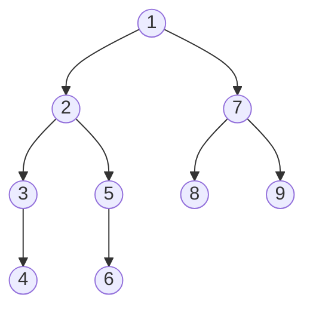

> [!NOTE]- 原题呈现
> # Codeforces 2193G - Paths in a Tree
> ## 题目描述
>
> 本题为交互式题目．
>
> 给你一个无环连通的无向图，包含 $n$ 个顶点．
> 定义一条从顶点 $v$ 到顶点 $u$ 的路径为一个由互不相同的顶点组成的序列 $p_1, p_2, \dots, p_k$，满足 $p_1 = v$，$p_k = u$，并且对于所有 $i$（$1 \le i < k$），顶点 $p_i$ 与 $p_{i+1}$ 之间都存在一条边．
>
> 图中有两个隐藏的顶点 $x$ 和 $y$（它们可能相同）．你可以进行如下询问：
>
> - 选择两个顶点 $a, b$（$1 \le a, b \le n$）．
> 交互库会返回 $1$，如果从 $x$ 到 $y$ 的路径与从 $a$ 到 $b$ 的路径**至少有一个公共顶点**；否则返回 $0$．
> 
> 你的任务是在**不超过 $\lfloor n/2 \rfloor + 1$ 次询问**内，找到至少一个位于 $x$ 到 $y$ 路径上的顶点．
>
> 注意：交互库是**自适应**的，这意味着隐藏的顶点可能会根据你的询问而改变，但不会与先前的回答矛盾．
>
> ## 输入格式
>
> 每个测试包含多个测试用例．
> 第一行包含一个整数 $t$（$1 \le t \le 10^4$）—— 测试用例的数量．接下来的行描述每个测试用例．
>
> 每个测试用例的第一行包含一个整数 $n$（$2 \le n \le 2 \cdot 10^5$）—— 图中顶点个数．
>
> 接下来 $n-1$ 行，每行包含两个整数 $v, u$（$1 \le v, u \le n$），表示顶点 $v$ 和 $u$ 之间有一条边．
>
> 保证所有测试用例的 $n$ 之和不超过 $2 \cdot 10^5$．
>
> ## 交互过程
>
> 为了找到路径上的顶点，你最多可以使用 $\lfloor n/2 \rfloor + 1$ 次询问．
> 询问格式为 `? a b`．
>
> 每次询问后，读入一个整数，即返回的 $0$ 或 $1$．
>
> 当你找到一个满足要求的顶点时，输出一行 `! v`（$1 \le v \le n$），其中 $v$ 是你找到的顶点．
>
> 如果你的程序对某个测试用例发出了超过 $\lfloor n/2 \rfloor + 1$ 次询问，那么交互库会返回 $-1$．在收到这样的回答后，你的程序应该立即终止，否则将得到“答案错误”的评判．否则，它可能会得到其他评判结果．
>
> 输出询问后，记得输出换行并刷新输出缓冲区，否则你会收到“超时”的评判．
> 在 C++ 中可使用 `fflush(stdout)` 或 `cout.flush()`；在 Java 中可使用 `System.out.flush()`；在 Python 中可使用 `stdout.flush()`；其他语言请参考相应文档．
>
> ## 样例
>
> ### 输入
> ```
> 3
> 
> 2
> 1 2
> 
> 1
> 
> 
> 3
> 1 2
> 1 3
> 
> 0
> 
> 0
> 
> 
> 4
> 1 2
> 2 3
> 2 4
> 
> 0
> 
> 1
> ```
>
> ### 输出
> ```
> ? 1 1
> 
> ! 1
> 
> 
> ? 1 1
> 
> ? 2 2
> 
> ! 3
> 
> 
> ? 1 3
> 
> ? 4 4
> 
> ! 4
> ```

首先，观察到询问次数的限制是 $\lfloor n/2 \rfloor + 1$，这说明我们每次至少要排除两个节点．

有以下一个结论：我们可以按照 dfn 次序，每一次询问 dfn 最靠前的两个没有被询问过的节点．如果回答是 `Yes`，则再花一次询问分出是询问的两个点其中哪一个点．如果回答 `No` 则接着询问另外两个 dfn 最靠前且没有被询问过的节点

为什么是这样呢？我们观察 dfn 连续的两个节点，发现它们只会存在两种位置关系：

- 一条边的两个顶点（如下图的 $(1,2)$，$(2,3)$）
- 分居于一个节点的两颗子树（如下图的 $(4,5)$，$(6,7)$）



对于第一种情况，由于本身就是一条边，不会有其他点干扰．因此，可以稳定地排除两个点；对于第二种情况，我们可以发现，对于一对点，其路径上的其他点必然在前面的询问中已经排除了．如 $(6,7)$ 这一对点，其路径上的 $1,2,5$ 都已经在前面的询问中被排除过了．因此也可以稳定地排除两个点．

**标程**

```cpp
#include <bits/stdc++.h>
using namespace std;
const int N = 2e5 + 100;
int n, dfn[N], cnt, id[N];
vector<int> e[N];

void dfs(int u, int fa) {
    dfn[u] = ++cnt;
    id[dfn[u]] = u;
    for (auto v : e[u]) {
        if (v != fa)
            dfs(v, u);
    }
}

void solve() {
    for (int i = 1; i <= n; ++i)
        e[i].clear();
    cin >> n;
    cnt = 0;
    int root = -1;
    for (int i = 1; i <= n - 1; i++) {
        int u, v;
        cin >> u >> v;
        if (root == -1) {
            root = u;
        }
        e[u].push_back(v);
        e[v].push_back(u);
    }
    dfs(root, 0);
    for (int i = 1; i + 1 <= n; i += 2) {
        cout << "? " << id[i] << " " << id[i + 1] << endl;
        cout.flush();
        int res;
        cin >> res;
        if (res == 1) {
            cout << "? " << id[i] << " " << id[i] << endl;
            cout.flush();
            cin >> res;
            if (res) {
                cout << "! " << id[i] << endl;
                cout.flush();
                return;
            } else {
                cout << "! " << id[i + 1] << endl;
                cout.flush();
                return;
            }
        }
    }
    cout << "! " << id[n] << endl;
    cout.flush();
}

signed main() {
    int t;
    cin >> t;
    while (t--) {
        solve();
    }
    return 0;
}
```