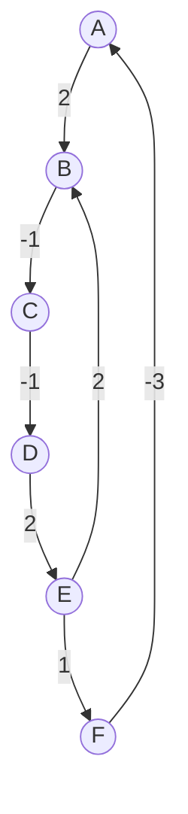

> [!NOTE]- 原题呈现
> # 遗忘与新生
>
> ## 题目背景
>
> 小信经营着一座“天体希尔伯特旅馆”．旅馆的房间编号遍布全部整数，而房间会按照编号对 $n$ 取模后的非负余数分配到不同楼层．
>
> ## 题目描述
>
> 旅馆共有 $n$ 个楼层．若两个房间编号除以 $n$ 的非负余数相同，则它们位于同一楼层．
>
> 现在有 $m$ 条搬迁指令．每条指令形如 $(a, b)$，表示：所有与房间 $a$ 位于同一楼层的住客，都可以搬进编号为自己的房间号加上 $b$ 的新房间．
>
> 对于每次查询给出的初始房间号 $x$，假设这 $m$ 条指令可以按任意顺序、任意次数反复使用．你需要判断：从房间 $x$ 出发，住客所有可能到达的房间号所形成的集合，是否是一个无限集合．
>
> ## 输入格式
>
> 第一行包含三个整数 $n, m, q$．
>
> 接下来 $m$ 行，每行两个整数 $a_i, b_i$，表示一条指令．
>
> 接下来 $q$ 行，每行一个整数 $x_j$，表示一个查询．
>
> ## 输出格式
>
> 对于每次查询，如果可能到达的房间号集合是无限集，则输出 `Yes`；否则输出 `No`．
>
> ## 样例
>
> ### 样例输入 #1
>
> ```
> 3 2 3
> 1 1
> -1 3
> 1
> 2
> 3
> ```
>
> ### 样例输出 #1
>
> ```
> Yes
> Yes
> No
> ```
>
> ### 样例输入 #2
>
> ```
> 3 2 3
> 1 1
> -1 0
> 1
> 2
> 3
> ```
>
> ### 样例输出 #2
>
> ```
> No
> No
> No
> ```
>
> ## 数据范围
>
> - $1 \le n, m, q \le 5 \times 10^5$
> - $-10^9 \le a_i, b_i, x_i \le 10^9$
> 
> ### 子任务
>
> | Subtask |   分值   | 特殊限制                                        |
> | :-----: | :----: | :------------------------------------------ |
> |    1    | 10 pts | $n, m, q \le 40$                            |
> |    2    | 10 pts | 对所有指令都满足 $b_i \equiv 0 \pmod n$             |
> |    3    | 20 pts | 对每个余数 $r$，至多存在一条指令满足 $a_i \equiv r \pmod n$ |
> |    4    | 20 pts | $n, m, q \le 3000$                          |
> |    5    | 40 pts | 无特殊限制                                       |

观察题目的“搬迁指令”，每一条允许与模 $n$ 为特定值的住户移动到另一层．我们知道，一名住户具体在哪一个房间并不重要，重要的是在哪一个楼层．因此，可以将每一个楼层抽象成一个点，将每一条搬迁指令抽象成一条边，从而组成一张图．

> [!NOTE] 小技巧：抽象化为图
> 如果题目表述满足有一些方法可以改变一种状态，并且每一种方法都可以使用多次，这就是一张以这种状态的每一个值为端点，每一种方法为边的有向图．若方法是可逆的，则是无向图．

那么什么样的住户所到的端点会是“无限集”呢？想象一下，让一个点在图上走，如果这个点走着走着不能走了，没路了，那么这个点所到的端点就不是“无限集”．显然，只有在环上运动才不会无路可走，即一个用户可以通过一些操作到回到自己原来的楼层．但是，如果通过这些操作最终回到的还是原来那个房间，那么住户到达的还是有限集．比如说以下这个样例：

```
3 2 1
1 2
3 -2
1
```

住户通过第一条指令从一号房搬到三号房，又通过第二条指令从三号房搬回一号房．这显然是一个环，但是不满足题意（只到达了一号和三号房）．

因此，对于一个住户，若该住户最终可以在一个环上运动，且移动的距离和不为 0，则这名住户所到的房间端点是一个无限集．抽象到图上，若以每一个搬迁指令的移动数量为这个指令对应边的权值，则符合条件的用户最终会走到一个权值和非 0 的环上．

那么首先，就需要把环求出来，就是求出图中的强连通分量．这部分可以用 tarjan 实现．

之后，对于每一个强连通分量，我们要判断其中有没有权值和非 0 的环．这部分可以使用 bfs 实现．我们知道，对于一个权值和为 0 的环，其满足若随机一个点为起始点，每一个点到起始点的距离唯一．因此，在环上进行遍历，并记录该点到起始点的距离．若第二次遍历到某点时，此时的权值与第一次不同（发现一个起始点到达该点距离不唯一的点），则这个强连通分量中必然存在权值非 0 的环．



如上图，若选定 A 为起始点，我们会发现，从 A 点到 B 点有多种距离．其一为 2，$A\to B$，其二为 4，$A\to B\to C \to D\to E\to B$．说明这个连通分量中含有权值和非 0 环．

我们对于每一个强连通分量，都跑一遍 bfs，如果该强连通分量中含有权值和非 0 环，则将这个分量打上标记．之后将每个强连通分量缩点（详见强连通分量 - 缩点），从而形成一个 DAG．

最后，通过逆向的拓扑序处理每一个节点 $i$．逆向拓扑序可以保证在处理每一个节点时，其可以到达的节点已经处理过了．在处理时，遍历所有能够一步到达 $i$ 的节点 $u$，若 $i$ 被标记了，那么可以把标记传到 $u$．根据缩点的相关知识，我们知道，tarjan 缩点后的点排列顺序天然是逆拓扑序．于是只需要根据 tarjan 缩点后点排列的顺序将标记进行扩散即可．

最后的最后，根据每一次询问，都检查：该点是否被打上了标记，如果是，输出 `Yes`，否则，输出 `No`．

**标程**

```cpp
#include <bits/stdc++.h>
using namespace std;
const int N = 5e5 + 100;
typedef long long ll;
#define int ll
const ll INF = 0x3f3f3f3f3f3f3f3f;
int n, m, q, dfn[N], low[N], cnt, bel[N], scc_cnt = 0;
bool in_stack[N], mark[N];
stack<int> s;
struct Node {
    int v, w;
};
vector<Node> e[N];
vector<int> g[N];
ll h[N];
int mod(int x) { return (x % n + n) % n; }

void tarjan(int u) {
    if (dfn[u])
        return;
    dfn[u] = ++cnt;
    low[u] = dfn[u];
    s.push(u);
    in_stack[u] = true;
    for (int i = 0; i < e[u].size(); i++) {
        int v = e[u][i].v;
        if (dfn[v] == 0) {
            tarjan(v);
            low[u] = min(low[u], low[v]);
        } else if (in_stack[v]) {
            low[u] = min(low[u], dfn[v]);
        }
    }
    if (low[u] == dfn[u]) {
        scc_cnt++;
        set<int> v;
        int top;
        do {
            top = s.top();
            s.pop();
            in_stack[top] = false;
            bel[top] = scc_cnt;
            v.insert(top);
        } while (top != u);
    }
}

bool check_scc(int start) {
    queue<int> qu;
    qu.push(start);
    h[start] = 0;
    while (!qu.empty()) {
        int u = qu.front();
        qu.pop();
        for (int i = 0; i < e[u].size(); i++) {
            int v = e[u][i].v;
            int w = e[u][i].w;
            if (bel[v] != bel[u]) {
                continue;
            }
            if (h[v] == INF) {
                h[v] = h[u] + w;
                qu.push(v);
            } else if (h[v] != h[u] + w) {
                return true;
            }
        }
    }
    return false;
}

signed main() {
    ios::sync_with_stdio(false);
    cin.tie(0);
    cout.tie(0);
    cin >> n >> m >> q;
    for (int i = 1; i <= m; i++) {
        int a, b;
        cin >> a >> b;
        e[mod(a)].push_back({mod(a + b), b});
    }
    for (int i = 0; i < n; i++) {
        tarjan(i);
    }
    memset(h, 0x3f, sizeof(h));
    for (int u = 0; u < n; u++)
        if (h[u] == INF && !mark[bel[u]])
            mark[bel[u]] = check_scc(u);
    for (int u = 0; u < n; u++) {
        for (auto v : e[u]) {
            int a = bel[u], b = bel[v.v];
            if (a != b) {
                g[a].push_back(b);
            }
        }
    }
    for (int u = 1; u <= scc_cnt; u++) {
        for (auto v : g[u]) {
            mark[u] |= mark[v];
        }
    }
    for (int i = 1; i <= q; i++) {
        int x;
        cin >> x;
        x = mod(x);
        if (mark[bel[x]]) {
            cout << "Yes" << endl;
        } else {
            cout << "No" << endl;
        }
    }
    return 0;
}
```
