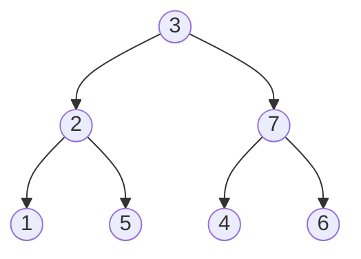

> [!NOTE]- 原题呈现
> # P9352 训猫 / Cat Exercise
>
> ## 题目描述
>
> 有 $N$ 个猫塔，编号从 $1$ 到 $N$．塔 $i$ 的高度为 $P_i$（$1 \le i \le N$）．这些塔的高度是 $1$ 到 $N$ 之间的不同整数．共有 $N - 1$ 对相邻的塔．对于每个 $j$（$1 \le j \le N - 1$），塔 $A_j$ 和塔 $B_j$ 是相邻的．最开始，可以通过从一个塔移动到相邻的塔，来从一个塔到达任何其他塔．
>
> 最开始，一只猫待在高度为 $N$ 的塔上．
>
> 然后我们进行**猫运动**．在猫运动中，我们反复选择一个塔并在其上放置一个障碍．然而，我们不能在已经放置障碍的塔上再放置障碍．在这个过程中，将发生以下情况：
>
> - 如果猫不在所选的塔上，什么也不会发生．
> - 如果猫在所选的塔上，并且所选塔的每个相邻塔上都有障碍，猫运动将结束．
> - 否则，在猫可以通过从塔移动到相邻塔而不受障碍影响到达的塔中，猫将移动到除当前塔外最高的塔．过程中，猫会选择从塔移动到相邻塔的步数最少的路线．
> 
> 给定塔的高度信息和相邻塔的对，编写程序计算在适当放置障碍的情况下，猫从塔移动到相邻塔的最大可能移动次数之和．
>
> ## 输入格式
>
> 从标准输入读取以下数据．
>
> $N$
> $P_1$ $P_2$ $\cdots$ $P_N$
> $A_1$ $B_1$
> $A_2$ $B_2$
>  $\vdots$
> $A_{N-1}$ $B_{N-1}$
>
> ## 输出格式
>
> 向标准输出写入一行．输出应包含猫从塔移动到相邻塔的最大可能移动次数之和．
>
> ## 输入输出样例 #1
>
> ### 输入 #1
>
> ```
> 4
> 3 4 1 2
> 1 2
> 2 3
> 3 4
> ```
>
> ### 输出 #1
>
> ```
> 3
> ```
>
> ## 输入输出样例 #2
>
> ### 输入 #2
>
> ```
> 7
> 3 2 7 1 5 4 6
> 1 2
> 1 3
> 2 4
> 2 5
> 3 6
> 3 7
> ```
>
> ### 输出 #2
>
> ```
> 7
> ```
>
> ## 说明/提示
>
> ## 样例
>
> ### 样例 1
>
> 如果我们按以下方式进行猫运动，猫总共移动 3 次．
>
> - 我们在塔 1 上放置一个障碍．猫不移动．
> - 我们在塔 2 上放置一个障碍．猫从塔 2 移动到塔 3．然后，猫从塔 3 移动到塔 4．
> - 我们在塔 4 上放置一个障碍．猫从塔 4 移动到塔 3．
> - 我们在塔 3 上放置一个障碍．然后猫运动结束．
> 
> 由于没有办法进行猫运动，使得猫从塔移动到相邻塔的次数大于或等于 4，因此输出 3．
>
> 此样例输入满足子任务 1、2、3、4、5、7 的约束．
>
> ### 样例 2
>
> 此样例输入满足子任务 4、6、7 的约束．
>
> ## 约束
>
> - $2 \le N \le 2\times 10^5$．
> - $1 \le P_i \le N$ ($1 \le i \le N$)．
> - $P_i \neq P_j$ ($1 \le i < j \le N$)．
> - $1 \le A_j < B_j \le N$ ($1 \le j \le N - 1$)．
> - 最开始，可以通过从一个塔移动到相邻塔，来从一个塔到达任何其他塔．
> - 给定的值都是整数．
> 
> ## 子任务
>
> 1. (7 分) $A_i = i, B_i = i + 1$ ($1 \le i \le N - 1$)，$N \le 16$．
> 2. (7 分) $A_i = i, B_i = i + 1$ ($1 \le i \le N - 1$)，$N \le 300$．
> 3. (7 分) $A_i = i, B_i = i + 1$ ($1 \le i \le N - 1$)，$N \le 5 000$．
> 4. (10 分) $N \le 5 000$．
> 5. (20 分) $A_i = i, B_i = i + 1$ ($1 \le i \le N - 1$)．
> 6. (23 分) $A_i =\left\lfloor\frac{i+1}2\right\rfloor, B_i = i + 1$ ($1 \le i \le N - 1$)．这里 $\lfloor x \rfloor$ 是小于或等于 $x$ 的最大整数．
> 7. (26 分) 无额外约束．

我们通过模拟样例可以得知，每一次猫的移动（设从 $u$ 到 $v$）都会将点 $u$ 和与和 $u$ 相邻的所有边全部删去，形成若干个互不连通的子树，同时，这只猫会跑到拥有更大高度点的子树上，其他子树都由于点 $u$ 的阻碍，而在后面的过程中不会被经过，因此可以被删去．我们可以贪心地只保留后续价值最大的子树（即使它并不含有当前高度最高的节点，如果这样，只需要将其余的高度最高的节点先堵上即可），这样问题就转化为在新的一棵树上的问题，这满足最优子问题．因此，考虑 dp．

树形的 dp 思路都是相似的．我们设 `dp[u]` 表示以 `u` 为根时，不经过所有高度大于 `u` 的点，所能完成的最长距离．从 $u$ 开始能够完成的最长距离可以理解为先从 $u$ 到达一个高度比它小的节点 $v$，然后利用从 $v$ 开始能够完成的最长距离加上从 $u$ 到 $v$ 的这段距离即可．因此，有转移方程：

$$
dp[u] = \max\{dp[v] + dist(u,v)\},p[u]>p[v]
$$

，其中，$dist(u,v)$ 表示 $u,v$ 两点间的距离．这个距离可以使用最近公共祖先．用 $u,v$ 的深度之和，减去多余的两倍最近公共祖先的深度即可，即 $dist(u,v)=dep(u)+dep(v)-2\times dep(lca)$，可以预处理出来．

由于高度大的节点的贡献不影响高度小的节点，我们将节点按高度从小到大排列．对于每一个节点 $u$，尝试以 $u$ 为根计算 `dp[u]`．可以进行一次从 $u$ 开始的 dfs，每次遍历到一个点就尝试用这个点的 dp 值去更新点 $u$ 的 dp 值．但要注意，搜索过程中如果遇到了高度比 $u$ 大的点需要立即 `return;`，因为路径上不能存在比 $u$ 高的点．

时间复杂度 $O(n^2)$．

考虑优化．我们有哪些是重复计算的？以样例 2 为例：



遍历过程如下：

- $u=1$，此时无路可走，$dp[1]=0$．
- $u=2$，此时能走到的点为 $\{1\}$，$dp[2] = dp[1]+1=1$．
- $u=3$，此时能走到的点为 $\{1,2\}$，$dp[3] = dp[2]+1=2$．
- $u=4$，此时无路可走，$dp[4]=0$．
- $u=5$，此时能走到的点为 $\{1,2,3\}$，$dp[5] = dp[3] + 2=4$．
- $u=6$，此时无路可走，$dp[6]=0$．
- $u=7$，此时能走到的点为 $\{1,2,3,4,5,6\}$，$dp[7]=dp[5]+3=7$．
- 遍历结束，答案为 $dp[7]=7$．

观察这个过程，我们发现，当遍历到节点 $2$ 时，由于 $1,2$ 相互连通，因此所有能够到达 $1$ 的点都能够到达 $2$，反过来也成立，这类似于强连通分量！因此，可以将这两个点缩成一个大点统一处理，这个大点的 dp 值即为大点中所有点最大的 dp 值，显然为 $dp[2]$．当遍历到节点 $7$ 时，可以给 $7$ 做出贡献的节点已经分成了三个大点：$\{1,2,3,5\},\{4\},\{6\}$，这实际上对应着 $7$ 的三条边，于是就不必枚举六个点，只需要枚举三个大点．

可以使用并查集来维护每一个节点归属于哪一个大点．特别的，我们设并查集中一个大点的根节点为这个大点中高度最高的点．这是因为 dp 值是随着高度增高而只增不降，因此高度更高的点能做出贡献也更多，可以使用根节点来代表这一个大点的贡献．

具体来说，在程序中，将所有节点按高度从小到大排序．这里有一个小技巧，显然点的编号在读完输入之后就没用了，又因为点的高度互不重复，因此可以使用点的高度作为编号进行存图．这样就不需要排序，直接从小到大遍历节点即可．设当前遍历到节点 $u$：

- 检查所有与 $u$ 仅使用一条边即能够到达的大点，使用这个大点的 dp 值更新自己的 dp 值．显然，若这个大点仅由一个点组成，且高度高于 $u$，则忽视这个大点．
- 接下来，将所有高度小于 $u$ 的大点（一个大点的高度定义为其中所有节点高度的最大值）和 $u$ 加入到并查集，将 $u$ 和所有满足条件的大点合并在一起，成为一个更大的大大点．

> [!NOTE] 小技巧
> 若在题目中发现形如“若一个点可以作为贡献，则所有与它满足某种联系的点都可以作为贡献”，考虑将这些满足联系的点组合成一个大点，整体提交贡献．这一般使用并查集进行维护．

**标程**

```cpp
#include <bits/stdc++.h>
#define int long long
using namespace std;
const int N = 2e5 + 100;
int n, dep[N], g[N], p[N];
vector<int> e[N];
int wt[N], id[N];
int cnt = 0;
int f[22][N];

int LCA(int a, int b) {
    if (dep[a] < dep[b]) {
        swap(a, b);
    }
    int delta = dep[a] - dep[b];
    for (int j = 20; j >= 0; j--) {
        if (delta & (1 << j)) {
            a = f[j][a];
        }
    }
    if (a == b)
        return a;
    for (int j = 20; j >= 0; j--) {
        if (f[j][a] != f[j][b]) {
            a = f[j][a];
            b = f[j][b];
        }
    }
    return f[0][a];
}

int qryDist(int a, int b) {
    int lca = LCA(a, b);
    return dep[a] + dep[b] - 2 * dep[lca];
}

void dfs(int u, int fa) {
    f[0][u] = fa;
    dep[u] = dep[fa] + 1;
    for (int i = 0; i < e[u].size(); i++) {
        if (e[u][i] != fa)
            dfs(e[u][i], u);
    }
}

// 并查集
struct DSU {
    int fa[N];
    void build(int size) {
        for (int i = 1; i <= size; i++) {
            fa[i] = i;
        }
    }
    int find(int x) {
        if (fa[x] == x) {
            return x;
        }
        fa[x] = find(fa[x]);
        return fa[x];
    }
    void merge(int x, int y) {
        x = find(x), y = find(y);
        if (x < y) {
            swap(x, y);
        }
        fa[y] = x;
    }
} dsu;

signed main() {
    ios::sync_with_stdio(false);
    cin.tie(0);
    cout.tie(0);
    cin >> n;
    for (int i = 1; i <= n; i++) {
        cin >> p[i];
    }
    for (int i = 1; i < n; i++) {
        int a, b;
        cin >> a >> b;
        e[p[a]].push_back(p[b]);
        e[p[b]].push_back(p[a]);
    }
    dfs(1, 0);
    for (int j = 1; j <= 20; j++) {
        for (int i = 1; i <= n; i++) {
            f[j][i] = f[j - 1][f[j - 1][i]];
        }
    }
    dsu.build(n);

    for (int u = 1; u <= n; u++) {
        for (int j = 0; j < e[u].size(); j++) {
            int v = e[u][j];
            if (v < u) {
                v = dsu.find(v);
                g[u] = max(g[u], g[v] + qryDist(u, v));
            }
        }
        for (int j = 0; j < e[u].size(); j++) {
            int v = e[u][j];
            if (v < u) {
                dsu.merge(u, v);
            }
        }
    }
    cout << g[n] << endl;
}

```
