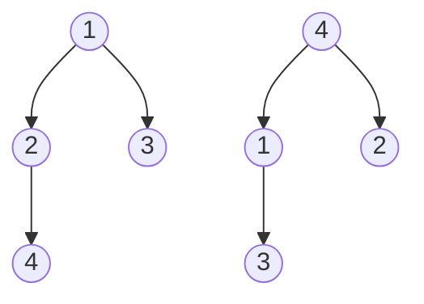

> [!NOTE]- 原题呈现
>
> # 风蚀
>
> ## 题目描述
>
> 考古队发现了一排古老的岩柱，一共有 $n$ 根，从左到右编号为 $1$ 到 $n$．
>
> 第 $i$ 根岩柱有一个坚硬度 $a_i$．保证所有坚硬度**两两不同**．
>
> 考古队会对一段连续岩柱做“风蚀实验”．
>
> 设这一段是从第 $l$ 根到第 $r$ 根．实验按“天”进行．
>
> 第 1 天，这一整段岩柱看成一个完整的连续块．之后每一天的操作会对当前所有连续块分别进行同样的操作，彼此互不影响：
>
> 1. 在这个连续块里，找出坚硬度最小的那一根岩柱；
> 2. 这根岩柱会在这一天被风蚀掉；
> 3. 记下一个二元组 $(L, R)$，其中：
> 	 - $L$ 表示这根岩柱左边、仍属于这个连续块的岩柱数量；
> 	 - $R$ 表示这根岩柱右边、仍属于这个连续块的岩柱数量．
> 
> 因为所有坚硬度两两不同，所以每个连续块里“最小的那根岩柱”总是唯一的．
>
> 把这一天所有连续块得到的二元组，按照这些连续块从左到右的顺序依次写下来，就得到这一天的**风蚀记录**．
>
> 当天结束后，被风蚀掉的岩柱消失．剩下的岩柱会分裂成若干个新的连续块，进入下一天．
>
> 如果某一天开始时已经没有岩柱了，那么这一天以及之后所有天的风蚀记录都视为空序列．
>
> 现在有 $q$ 次询问．
>
> 每次询问给出两段连续区间 $[l_1, r_1]$ 和 $[l_2, r_2]$．
>
> 如果这两段区间在**每一天**得到的风蚀记录都完全相同，就称它们是**同谱**的．
>
> 你需要对每次询问回答这两段区间是否同谱．
>
> ## 输入格式
>
> 第一行两个整数 $n, q$．
>
> 第二行 $n$ 个整数 $a_1, a_2, \dots, a_n$，表示每根岩柱的坚硬度．保证它们两两不同．
>
> 接下来 $q$ 行，每行四个整数 $l_1, r_1, l_2, r_2$，表示一次询问．
>
> ## 输出格式
>
> 对于每次询问输出一行．
>
> 如果两段区间同谱，输出 `Yes`；否则输出 `No`．
>
> ## 样例
>
> ### 输入 #1
>
> ```
> 7 5
> 3 1 4 2 7 5 6
> 1 3 5 7
> 1 4 4 7
> 2 4 5 7
> 1 1 4 4
> 3 6 4 7
> ```
>
> ### 输出 #1
>
> ```
> Yes
> No
> No
> Yes
> No
> ```
>
> ### 样例解释
>
> - 区间 $[1,3]$ 的序列是 $(3,1,4)$，区间 $[5,7]$ 的序列是 $(7,5,6)$．它们第一天都会删掉中间位置的最小值，得到记录 $(1,1)$；第二天左右各剩一个单点块，记录也完全一样，所以它们同谱．
> - 区间 $[1,4]$ 和 $[4,7]$ 第一天删掉最小值后，左右剩余规模就不同，因此不同谱．
> 
> ## 数据范围
>
> 对于所有测试数据，均有：
>
> - $1 \le n, q \le 5 \times 10^5$
> - 对于所有 $1 \le i \le n$，均有 $1 \le a_i \le n$，且 $a_1, a_2, \dots, a_n$ 两两不同；
> - 对于所有询问，均有 $1 \le l_1 \le r_1 \le n,\ 1 \le l_2 \le r_2 \le n$．
>
> | 测试点编号 | $n \le$ | $q \le$ | 特殊性质 |
> | :---: | :---: | :---: | :--- |
> | 1 | 500 | 500 | 无 |
> | 2 | 2000 | 2000 | 无 |
> | 3 | 3000 | 3000 | 无 |
> | 4, 5 | 50000 | 50000 | A |
> | 6 | 100000 | 100000 | B |
> | 7 | 100000 | 100000 | C |
> | 8 | 100000 | 100000 | D |
> | 10 | 100000 | 100000 | E |
> | 9, 11 | 200000 | 100000 | 无 |
> | 12 | 200000 | 100000 | D |
> | 13, 14 | 300000 | 200000 | 无 |
> | 15, 16 | 300000 | 200000 | D |
> | 17 ~ 20 | 500000 | 500000 | 无 |
>
> **特殊性质说明**：
>
> - **A**：对于所有询问，均有 $r_1 - l_1 + 1 \le 32$ 且 $r_2 - l_2 + 1 \le 32$．
> - **B**：数组严格递增，即对于所有 $1 \le i \le n$，均有 $a_i = i$．
> - **C**：数组严格递减，即对于所有 $1 \le i \le n$，均有 $a_i = n - i + 1$．
> - **D**：数组为交错排列，即 $a = (1, n, 2, n-1, 3, n-2, \dots)$．
> - **E**：对于所有询问，均有 $l_1 = l_2 = 1$．

观察题目中的风蚀，我们可以发现，这是判断两棵笛卡尔树是否同构．

> [!NOTE] 笛卡尔树
> 每一次都以当前区间内最小的点作为根节点，将最小点的左边定为左子树，将最小点的右边定为右子树，接着分别对于左边和右边建树．示意图如下：
>
>  ![[cartesian-tree1.png]]
>  （图源 oi-wiki）
>
>  这棵树在构建时，会将序列中最小的节点 1 取出作为根节点，将 1 左边的节点 $9,3,7$ 作为左子树节点，右边的 $8,12,10,20,15,18,5$ 作为右子树节点，然后对于左子树和右子树分别递归建树．
>
>  笛卡尔树除了上述的构建方法，还可以使用单调栈进行构建．
>
> 具体来说，构建一个从栈底到栈顶从小到大排列的单调栈，从左到右依次让元素进栈：
> - 若当前栈顶的元素比将要进栈的元素 $i$ 大，则令栈顶元素出栈．记录最后一个出栈的元素为 $j$．
> - 设通过上面一步之后，栈顶元素为 $k$，则 $i$ 是 $k$ 的右子节点，$j$ 及其子树为 $i$ 的左子节点．
>
> 示意图如下．实际上，栈中维护的序列就是示意图中红框标出来的部分组成的序列：
>
> ![[cartesian-tree2.png]]
>
> （图源 oi-wiki）

这里，两棵树同构是指这两棵树形状相同，但不代表它们每一个点的权值相同．如下面的两棵树是同构的：



显然，每一次如果都构建笛卡尔树并且暴力比较是否同构必定超时，那该怎么做呢？

可以将笛卡尔树转换为一个序列．由单调栈构建法可以从中得出灵感，我们定义 $L_i$ 表示区间 $[l,r]$ 第 $i$ 个元素左边第一个小于 $a_i$ 元素的位置（这里的位置时区间内的相对位置，而不是全局的位置）．特别的，若没有这样的元素，即 $a_i$ 为当前区间的前缀最小值，则令 $L_i=0$．显然，在考虑第 $i$ 个元素时，只需要将其接在元素 $L_i$ 的右节点，如果 $L_i$ 有右节点，则将原来的右节点挤到左节点即可，这样构造出的笛卡尔树形状是唯一的，因此，对于一个 $\{L_i\}$ 序列，其笛卡尔树是唯一确定的，这样只需要比较 $\{L_i\}$ 序列即可．

如果只是暴力计算 $\{L_i\}$ 序列再比较，每一次询问都是 $O(n)$ 的，这肯定不行，考虑优化．

我们可以使用单调栈预处理 $p$ 数组，用于记录每个元素左边第一个比它小的元素．关于 $p$ 数组的构造，具体来说，维护一个栈底小的单调栈，从前往后遍历每一个点，对于每一个点 $i$，若栈顶的元素比 $i$ 大，则将栈顶元素舍弃，这是由于有 $i$ 的存在，栈顶元素不可能作为后续元素所记录的“每个元素左边第一个比它小的元素”．直到栈顶元素比 $i$ 小，此时栈顶元素就是 $p_i$．

则 $L_i$ 可以尝试使用 $p_I$ 推导．此处为了不造成混淆，令全局下标为 $I$，局部下标为 $i$，因此存在 $i=I-l+1$，此处 $l$ 是区间左边界．推导过程如下：

- 若 $p_I< l$，则表示元素 $I$ 左边第一个比它小的元素不在 $[l,r]$ 之中．因此特殊的，置 $L_i=0$．
- 否则，$L_i=P_I-l+1$．

此处变量 $l$ 每一次查询都会变化，尝试将其优化．

$$
\begin{aligned}
L_i&=P_I-l+1\\
L_i+I&=P_I+I-l+1\\
L_i&=P_I+i-I\\
L_i-i&=P_I-I\\
i-L_i&=I-P_I
\end{aligned}
$$

这样，若设 $d_i=i-L_i$，特别的，若 $L_i=0$，则 $d_i=0$．则公式简化为：

$$
d_i=I-P_I
$$

由于 $d_i$ 和 $L_i$ 一一对应，因此知道一个确定的 $\{d\}$ 序列也可以确定笛卡尔树的形状．显然，$d$ 数组可以预处理出来．我们可以使用类似字符串哈希的方法来快速判定两个序列是否相等．若设哈希基数为 $B$，则 $\{d\}$ 序列哈希可以表示为：

$$
\operatorname{Hash}_{d[1,m]}=\sum_{i=1}^{m}B^{i-1}d_i
$$

对于询问 $[l,r]$，其哈希值为（$[p_i\geq l]$ 是指示函数，当且仅当 $p_i\geq l$ 成立时，其值为 1，否则为 0）：

$$
\begin{aligned}
\operatorname{Hash}_{d[l,r]}&=\sum_{i=l}^{r}([p_i\geq l]B^{i-l}d_i)\\
&=\sum_{i=l}^{r}([p_i\geq l]B^iB^{-l}d_i)\\
&=B^{-l}\sum_{i=l}^{r}([p_i\geq l]B^id_i)
\end{aligned}
$$

因此只需要求出两个区间的哈希，再一比较，若相等，就可以认为这两个区间符合题意．如何快速求出两个区间的哈希呢？

如果暴力枚举公式中的 $i\in[l,r]$，则单次查询复杂度回到了 $O(n)$，白优化了．若设 $w_i=B^id_i$，那么就需要快速求出 $[l,r]$ 区间内 $p_i\geq l$ 的项的区间和．由于 $p_i$ 随着 $i$ 的增大而增大，因此满足 $p_i\geq l$ 的项数量肯定是随 $i$ 增大而减少的．且已经不满足条件的项不可能在之后的过程中重新满足条件．这可以使用树状数组来优化．具体来说，在树状数组中储存所有在当前还满足要求的 $w_i$：

- 在遍历开始前，将所有的 $i$ 以 $i$ 作为键，$w[i]$ 作为值加入到树状数组．
- 离线所有的查询，将每一次查询中的区间拆开，一共 $2q$ 个区间，将这些区间按照 $l$ 从小到大排序．依照这个顺序依次解决每一个区间的哈希值．
- 对于每一个左端点为 $l$ 的一组请求，我们依次处理，每一次处理时，依照公式，先用树状数组计算 $[l,r]$ 之间的区间和，再乘 $B^{-l}$，即 $B^l$ 的逆元．
- 解决完一组请求之后，设下一组请求的左端点为 $l'$，则满足 $p_i\in[l,l')$ 的 $i$ 值都将不满足条件，将它们从树状数组中删除，即置为 0．

当然，为了防止冲突，除了使用双哈希之外，对于每一个询问，还需要特判这两个区间长度是否相等，如果不相等，直接为 `No`．（序列 $\{0\}$ 和 $\{0,0\}$ 这两者的哈希是相同的）

> [!NOTE] 小技巧：求带前置条件的前缀和
> 有的时候，我们需要求出区间 $[l,r]$ 中所有符合某种条件的元素之和，若这个条件符合单调性，即随着某一个变量的增大或减小，符合条件的元素逐渐变多，且开始符合条件的元素不可能在之后的某一瞬间不符合条件，则称这个条件具有单调性．这个与之相关的变量成为单调变量．
>
> 面对有单调性条件的区间部分元素求和问题，我们可以使用树状数组．具体来说，将所有元素按单调变量的顺序递增或递减排列，当遍历到某一个元素时，将从此刻起开始符合条件的元素加入树状数组．

**标程**

```cpp
#include <bits/stdc++.h>
typedef long long ll;
#define inv(x, MOD) (fastpow(x, MOD - 2, MOD))
#define w(x, MOD) (fastpow(BASE, x, MOD) * (x - p[x]) % MOD)
using namespace std;
const int N = 5e5 + 100;
const int BASE = 127;
const int MOD1 = 1e9 + 7;
const int MOD2 = 1e9 + 9;
int n, q, a[N], p[N];
bool ans[N];
vector<int> buc[N];
map<int, ll> mp1, mp2;
struct Query {
    int l, r, id;
    friend bool operator<(const Query a, const Query b) { return a.l < b.l; }
};
vector<Query> qry;

ll fastpow(int a, int p, int MOD) {
    ll ans = 1, now = a;
    while (p > 0) {
        if (p & 1) {
            (ans *= now) %= MOD;
        }
        p >>= 1;
        (now *= now) %= MOD;
    }
    return ans;
}

struct BIT {
    ll f[N];
    int MOD;
    BIT(int MOD) : MOD(MOD) {}
    int lowbit(int x) { return x & (-x); }
    void Modify(int pos, int v) {
        if (v < 0)
            v += MOD;
        for (int i = pos; i <= n; i += lowbit(i)) {
            (f[i] += v) %= MOD;
        }
    }
    int Query(int pos) {
        if (pos == 0)
            return 0;
        ll ans = 0;
        for (int i = pos; i >= 1; i -= lowbit(i)) {
            (ans += f[i]) %= MOD;
        }
        return ans;
    }
    int Query(int l, int r) { return (Query(r) - Query(l - 1) + MOD) % MOD; }
} bit1(MOD1), bit2(MOD2);

signed main() {
    ios::sync_with_stdio(false);
    cin.tie(0);
    cout.tie(0);
    cin >> n >> q;
    for (int i = 1; i <= n; i++) {
        cin >> a[i];
    }
    stack<int> sta;
    for (int i = 1; i <= n; i++) {
        while (!sta.empty() && a[sta.top()] >= a[i]) {
            sta.pop();
        }
        if (sta.empty()) {
            p[i] = 0;
        } else {
            p[i] = sta.top();
        }
        sta.push(i);
    }
    for (int i = 1; i <= q; i++) {
        int l1, l2, r1, r2;
        cin >> l1 >> r1 >> l2 >> r2;
        if (r1 - l1 != r2 - l2) {
            ans[i] = false;
            continue;
        }
        qry.push_back({l1, r1, i});
        qry.push_back({l2, r2, i});
    }
    sort(qry.begin(), qry.end());
    for (int i = 1; i <= n; i++) {
        if (p[i]) {
            bit1.Modify(i, w(i, MOD1));
            bit2.Modify(i, w(i, MOD2));
            buc[p[i]].push_back(i);
        }
    }
    int cur_l = 1;
    for (auto query : qry) {
        while (cur_l != -1 && cur_l != query.l) {
            for (auto x : buc[cur_l]) {
                bit1.Modify(x, -w(x, MOD1));
                bit2.Modify(x, -w(x, MOD2));
            }
            cur_l++;
        }
        ll hs1 = inv(fastpow(BASE, query.l, MOD1), MOD1) *
                 bit1.Query(query.l, query.r) % MOD1;
        ll hs2 = inv(fastpow(BASE, query.l, MOD2), MOD2) *
                 bit2.Query(query.l, query.r) % MOD2;
        if (mp1.count(query.id)) {
            if (mp1[query.id] == hs1 && mp2[query.id] == hs2) {
                ans[query.id] = true;
            } else {
                ans[query.id] = false;
            }
        } else {
            mp1[query.id] = hs1;
            mp2[query.id] = hs2;
        }
    }
    for (int i = 1; i <= q; i++) {
        if (ans[i]) {
            cout << "Yes" << endl;
        } else {
            cout << "No" << endl;
        }
    }
    return 0;
}
```

[^1]:
